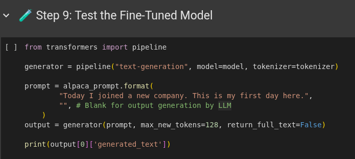
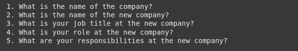
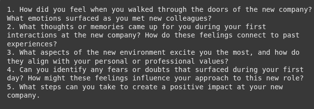

# 📔 Journal-LLM

<a href="https://huggingface.co/thesleebit/journal-llm-v2" target="_blank"></a>
<a href="https://www.python.org/" target="_blank"></a>

> A fine-tuned language model for journal-related tasks

## 🌟 Overview

Journal-LLM is a specialized language model fine-tuned on journal data. The model is trained on a custom dataset and optimized for journal-related text generation and analysis.

## 🔗 Resources

<div align="center">

| Resource | Link |
|:-------:|:----:|
|  | <a href="https://huggingface.co/thesleebit/journal-llm-v2" target="_blank">**Fine-tuned Model pushed to Hugging Face**</a> |
|  | <a href="https://colab.research.google.com/drive/1NlqXAOOxmmBBQcWlKoC-XnXrmWXsYEXx?usp=sharing" target="_blank">**Training Notebook on Google Colab**</a> |

</div>

## 📊 Dataset

The model is trained on `dataset.jsonl` (400 rows), which contains structured journal entries paired with reflective questions. The dataset is generated using the `build_dataset.py` script, which works as follows:

1. **Base Data**: Uses a diverse collection of 400+ life events from `utils/life_events.json` (e.g., "Starting a new job", "Moving to a new city")

2. **Generation Process**:
   - Selects life events from carefully curated collection of 400 life events
   - For each event, generates an authentic first-person journal entry using GPT-4o-mini
   - Creates 5 thoughtful follow-up questions for each entry that explore emotions, patterns, perspectives, values, and actionable insights
   - Saves each entry-questions pair to `dataset.jsonl` in a structured format

3. **Data Format**: Each record in the JSONL file contains:
   - `input`: The generated journal entry text
   - `output`: Five reflective questions that prompt deeper introspection

This synthetic dataset provides diverse training examples for the model to learn effective journaling analysis patterns.

## 📸 Results

### Model Testing Code


*Code snippet showing how to test the fine-tuned model*

### Before Fine-tuning


*Model output before the fine-tuning process*

### After Fine-tuning
> Style of the model output matches input dataset style.


*Model output after fine-tuning, showing improved performance*

## 🚀 Quick Start

### Installation

```bash
uv venv journal --python 3.12
source journal/bin/activate
uv pip install -r requirements.txt
```

### Building the Dataset

```bash
uv run build_dataset.py
```

### Running the Model (GPU Required)
> It will pull the finetuned model from huggingface and run it using transformers using `AutoModelForCausalLM.from_pretrained`

```bash
uv run run_llm.py
```

## 📄 Other Tasks

- <a href="assignments/REVIEW_SUMMARISER.md" target="_blank">Review Summariser for Ops Team</a> - Documentation for the review summarization feature
- <a href="assignments/AI_ROADMAP.md" target="_blank">AI Feature Suggestion</a> - Future features and AI integration plans
- <a href="assignments/User_Experience_Issues.md" target="_blank">User Experience Issues</a> - Current UX issues and proposed solutions


---

<p align="center">Made with ❤️ by <a href="https://github.com/codeit13" target="_blank">Sumit Chauhan</a></p>

---

## 🤔 Additional -  Journal Analysis Tool

The Journal Analysis Tool is a new feature that helps users gain insights from their journal entries. It analyzes the text and generates thoughtful, open-ended questions to promote deeper reflection.

### Features

- **Mood Analysis**: Detects the emotional tone of your journal entry
- **Topic Identification**: Identifies key themes and topics discussed
- **Reflection Questions**: Generates 5 personalized, open-ended questions
- **Comprehensive Analysis**: Provides a detailed analysis of your writing

### Running the Journal Analyzer

```bash
uv run ai_agent/run.py tmp/journal_entry.txt
```

You can also specify a custom output file:

```bash
uv run ai_agent/run.py tmp/journal_entry.txt -o tmp/my_analysis.md
```

### Sample Output

The analyzer generates a Markdown file with sections for:

- Overview of your journal entry
- Mood analysis with emotional indicators
- Topics identified with importance ratings
- Reflection questions with context
- Summary with insights

---