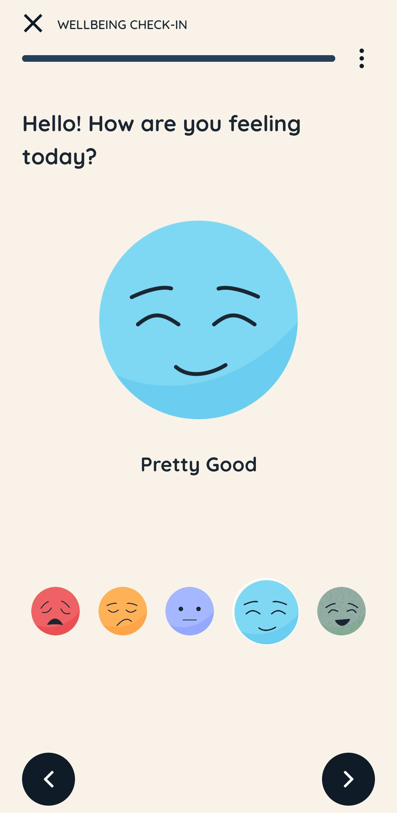
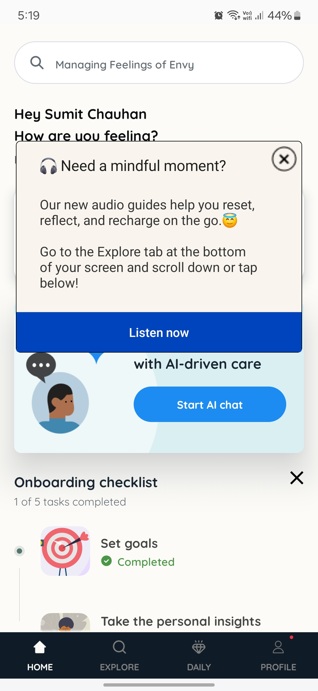
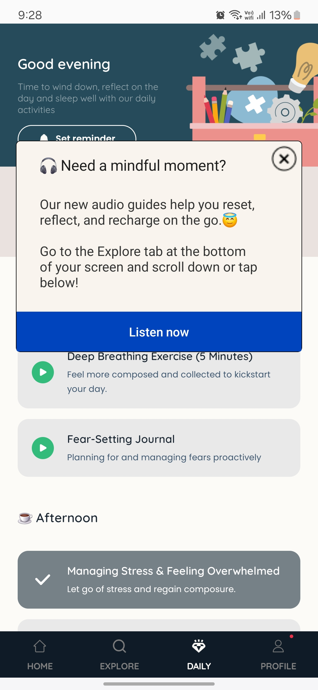

# User Experience Issues

## Static Emoji Enhancement

Currently, when asking users about their mood, the app displays static emoji images. This interaction could be improved to make the experience more engaging.

### Visual Reference

### Proposed Solutions

1. **Animated Emojis**: Replace static emojis with animated SVGs or GIFs that respond to user interaction.
   - When a user hovers over an emoji, it could subtly animate.
   - When selected, the chosen emoji should display a more pronounced animation reflecting its emotion.

2. **Alternative Approach**: If animated GIFs would make the UI too cluttered:
   - Keep emojis static initially
   - Once a user clicks/selects an emoji, only that specific emoji animates according to its respective emotion
   - This provides feedback to the user while maintaining a clean interface

   
## Popup Overflow Issue

The Intellect app has an issue where popups opened on a second screen don't automatically close when navigating back to the home screen.

### Visual References

### Proposed Solution

Implement some sort of navigation event listener that might be present in react-native, which automatically closes any open popups when the user navigates to a different screen, especially when returning to the home screen.