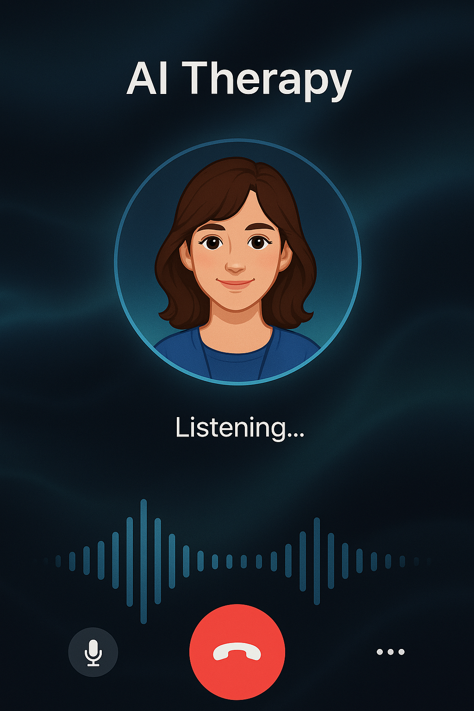
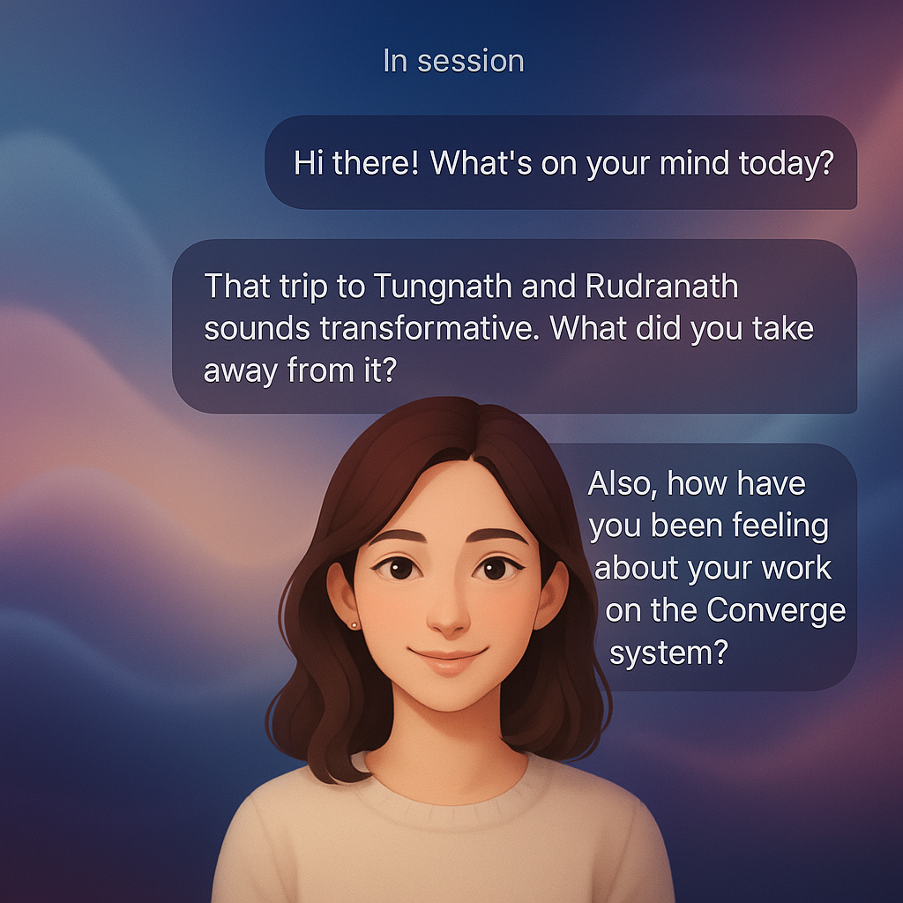

# Suggested Feature

## AI Therapist Feature

The AI Therapist feature will provide users with an immersive therapeutic experience through an intuitive audio interface. Users will interact with a comforting AI voice model in a sleek UI similar to OpenAI's voice mode, enabling natural and unlimited conversations. The AI will be specifically trained to respond with therapeutic techniques and empathetic listening, creating a safe space for users to express themselves freely.

Behind this seamless user experience, the system will analyze conversations to extract meaningful insights about the user's emotional patterns, stressors, and progress. These key insights will be automatically documented in the journal section, creating a valuable record of the user's mental health journey without requiring manual entry. This integration ensures that therapeutic conversations contribute directly to the user's ongoing self-reflection and personal growth tracking.

## Tech what we can use in this

- **Audio Interface**: WebRTC
- **Speech to Text Model**: Deepgram (Low Latency)
- **Text to Speech Model**: ElevenLabs/ Deepgram / Coqui
- **LLM**: OpenAI/ Groq/ Open Source Models
- **Phone Number**: Twilio

## Few mockup's I generated using AI

### First Mockup

### Second Mockup

For more information on Journal-LLM, see the [main README](../README.md).
