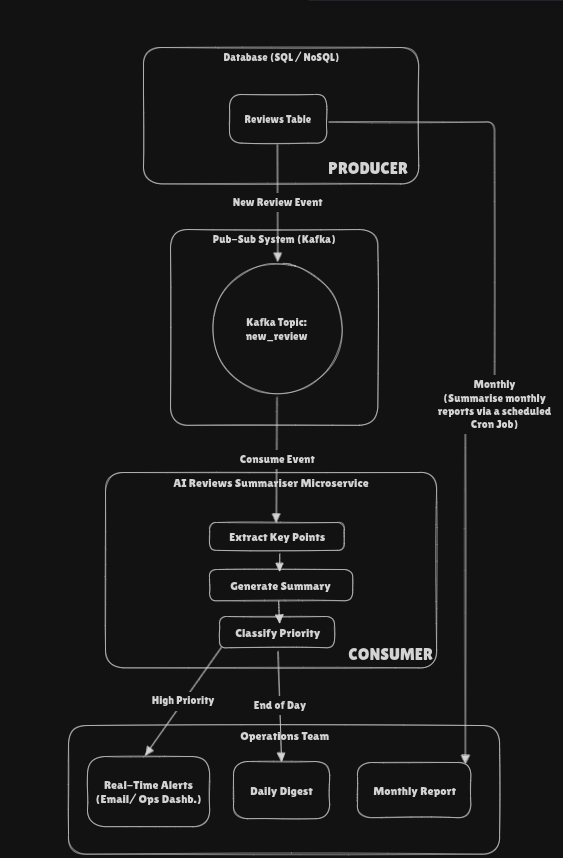

# Review Summarisation Automation

## Overview

Automate extraction and summarisation of user reviews for the Operations Team:

- **Real-time alerts** for high-priority issues
- **Daily digest** of all reviews
- **Monthly report** summarising trends

## Architecture



## Components

- **Producer (DB)**
  - A new review comes from various sources in our Database.
  - Emits review message to `new_review` topic in Kafka.

- **Kafka**
  - Topic: `new_review`
  - Buffers review events.

- **Consumer (Microservice)**
  1. Extract key insights from review using LLM
  2. Generate summary/ Sentiment analysis of review
  3. Classify priority (high/ medium/ low)

- **Notifier**
  - **High-priority** → real-time email / Ops dashboard
  - **End of day** → daily digest via email (using kafka/ cron, both are feasable)
  - **Monthly Cron** → compiled report

## Tech Stack

- **Database**: PostgreSQL / MongoDB
- **Messaging**: Apache Kafka
- **Service**: Python / Node.js microservice
- **AI Model**: LLM (fine-tuned for review analysis)
- **Scheduling**: `cron` (monthly reports)
- **Notifications**: SMTP / Slack / Ops dashboard / Save to Ops Database Channels

## Deployment & Setup

1. **Database**
   - Create `reviews` table/collection
   - Grant read/write access

2. **Kafka**
   - Create topic `new_review`
   - Configure brokers

3. **Microservice**
   - Create a python AI Agent for summarizing reviews.

4. **Scheduling**
   - Add monthly report job to crontab:
     ```cron
     0 0 1 * * /path/to/monthly_report.sh
     ```

---

For more information on Journal-LLM, see the [main README](../README.md).

